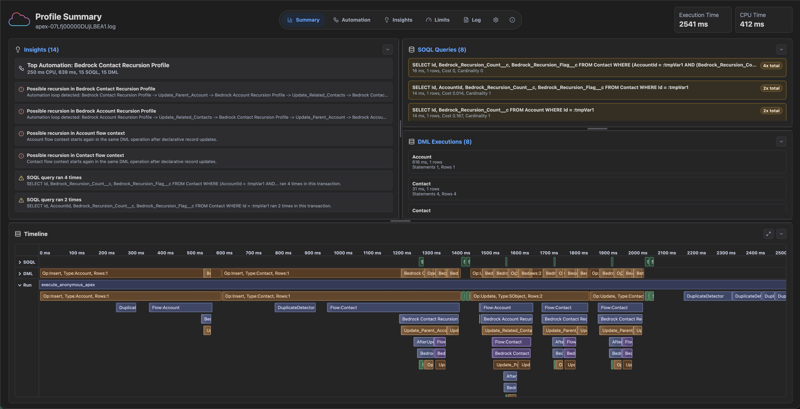
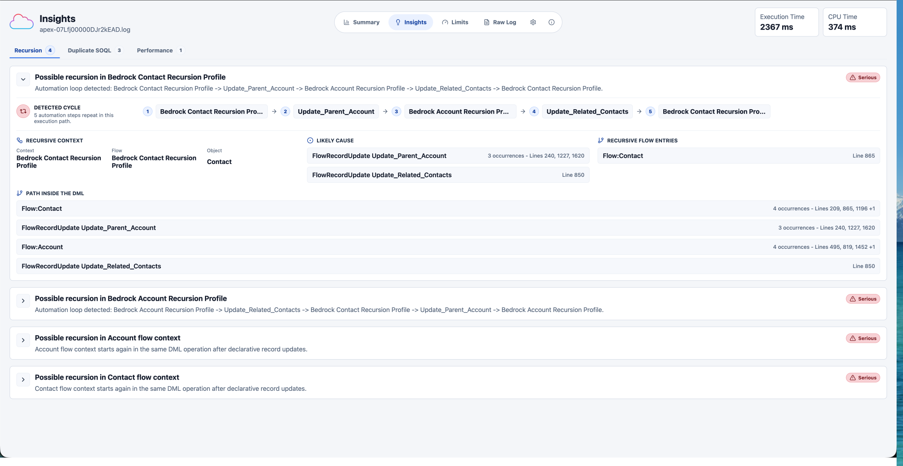
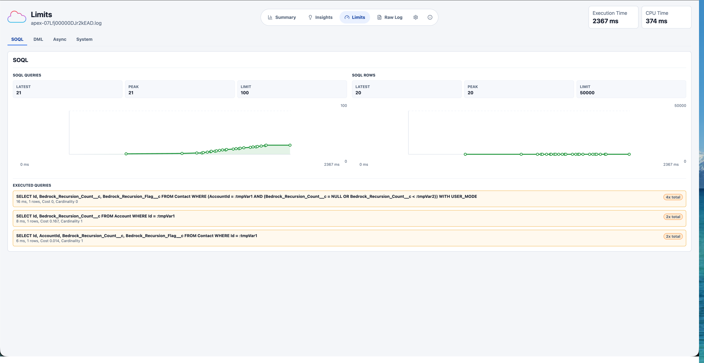
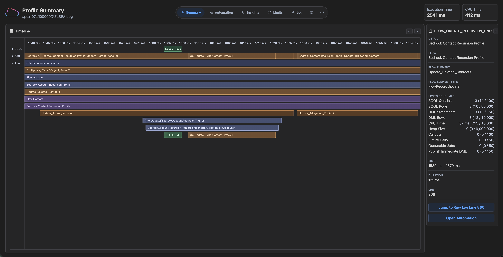

# SF Profiler

SF Profiler is a Salesforce debug log profiler for Apex, Flow, SOQL, DML,
governor limits, recursion risk, and performance hotspots.

Use it in the browser at [sfprofiler.com](https://sfprofiler.com/) or install
the VS Code extension from the
[Visual Studio Marketplace](https://marketplace.visualstudio.com/items?itemName=force-creators.sf-profiler).

SF Profiler is built for the moments where a Salesforce debug log is technically
complete but practically unreadable. It turns dense execution traces into a
timeline, targeted insights, and limit views that make automation behavior much
easier to explain.

## What It Helps With

- **Declarative automation visibility**: See Flow and other declarative
  automation alongside Apex, DML, and SOQL.
- **Recursion detection**: Surface likely automation loops, repeated flow
  contexts, and recursive paths through DML.
- **Performance insights**: Find repeated SOQL, expensive execution patterns,
  and the parts of the transaction most likely to deserve attention.
- **Governor limit context**: Track SOQL, DML, async, CPU, heap, callout, and
  publish-immediate usage without manually hunting through raw log lines.
- **Local processing**: Logs are parsed on your device. Your debug log content
  does not need to be uploaded to an external service.

## Insights

The Insights view can identify probable automation recursion, show the detected
cycle, call out likely causes, and list the path through Flow and DML that
produced the loop.

## Limits

The Limits view groups governor usage and related executions so you can see what
actually moved the counters. Repeated queries are grouped together, row counts
and timings stay visible, and you can jump from the symptoms back into the
timeline.

## Timeline

The timeline connects the transaction in execution order: Apex, Workflow/Flow,
SOQL, DML, and other events. It is designed for the "what happened first?" and
"why did this happen again?" questions that raw debug logs make painful.

## Project Layout

- `packages/core`: framework-free Salesforce debug log parser and profiler.
- `apps/web`: Vite + React browser app.
- `apps/desktop`: Electron shell for the web app.
- `apps/vscode`: VS Code extension for profiling `.log` files from Explorer or
  the editor.
